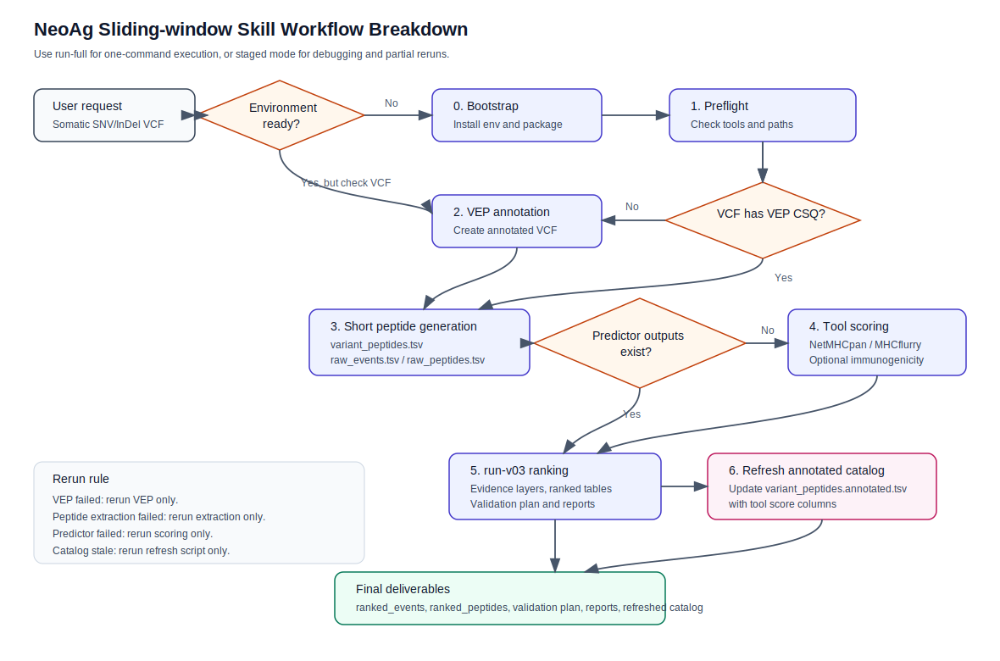
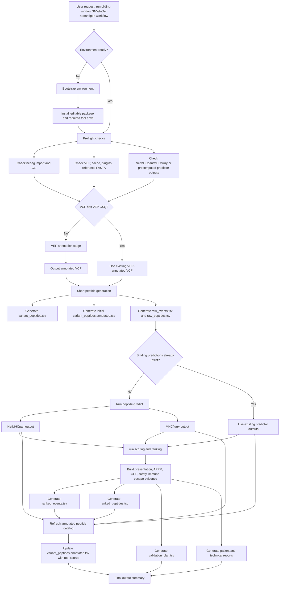

# NeoAg Sliding-window Skill Workflow Breakdown

This document explains how the `neoag-sliding-run` skill decomposes a somatic SNV/InDel VCF workflow into install/preflight, VEP annotation, short peptide generation, tool scoring, annotated catalog refresh, ranking, validation, and reporting stages.

## Rendered Diagram

The SVG below is committed with the skill so the workflow can be viewed directly in Markdown preview, GitHub, or other renderers that do not support Mermaid.



## End-to-end Flow

The Mermaid source below is kept as an editable diagram source.



## Stage Breakdown

| Stage | Purpose | Main inputs | Main outputs | Notes |
| --- | --- | --- | --- | --- |
| 0. Environment bootstrap | Prepare a new machine or broken environment. | Repository checkout, conda, optional licensed tool installers. | Working `neoag`, importable `neoag.tools`, available tool wrappers. | Only run when needed. Do not reinstall tools on every sample run. |
| 1. Preflight | Confirm the selected execution mode can run. | `conf/tools.env.sh`, local tool paths, sample paths, HLA alleles. | Pass/fail status for CLI, VEP, VEP cache/plugins, reference FASTA, NetMHCpan/MHCflurry. | If using precomputed predictor outputs, local NetMHCpan/MHCflurry can be skipped. |
| 2. VEP annotation | Add VEP `CSQ` and plugin annotations to an unannotated VCF. | Somatic SNV/InDel VCF, reference FASTA, VEP cache, VEP plugins. | `<outdir>/upstream/tools/<sample_id>.vep.annotated.vcf.gz`. | Skip only if the input VCF already has valid `CSQ`. |
| 3. Short peptide generation | Convert VEP-annotated variants into candidate peptide and raw event tables. | VEP-annotated VCF, tumor sample name, HLA alleles, optional normal proteome FASTA. | `variant_peptides.tsv`, initial `variant_peptides.annotated.tsv`, `raw_events.tsv`, `raw_peptides.tsv`. | `raw_peptides.tsv` is the scoring input; `variant_peptides.annotated.tsv` is an explorable catalog sidecar. |
| 4. Tool scoring | Generate peptide-HLA predictor evidence. | `raw_peptides.tsv`, HLA alleles, NetMHCpan/MHCflurry tools or existing outputs. | `presentation/netmhcpan.xls`, `presentation/mhcflurry.csv`, optional immunogenicity outputs. | Re-run this stage when predictor settings or HLA alleles change. |
| 5. Ranking and reports | Build evidence layers, rank candidates, and generate validation/report outputs. | `raw_events.tsv`, `raw_peptides.tsv`, predictor outputs, optional expression/LOH/purity/CNV evidence. | `ranked_events.tsv`, `ranked_peptides.tsv`, `validation_plan.tsv`, HTML reports. | This is the main `run` scoring and report stage. |
| 6. Annotated catalog refresh | Update the candidate catalog with post-scoring tool evidence. | `variant_peptides.tsv`, HLA alleles, NetMHCpan/MHCflurry and optional immunogenicity outputs. | Final `variant_peptides.annotated.tsv`. | This is required in staged mode so the review catalog includes tool scores. `run-full` already performs this refresh automatically. |

## One-command Path

Use this path for simple runs and smoke tests:

```bash
neoag run-full \
  --config conf/run.<sample_id>.sliding.private.toml \
  --outdir results/<sample_id>_sliding
```

`run-full` orchestrates VEP detection/annotation, peptide extraction, binding prediction, ranking, report generation, and final `variant_peptides.annotated.tsv` refresh.

## Staged Path

Use this path for production debugging, partial reruns, or when VEP/predictor stages are expensive:

```text
0. Bootstrap if needed
1. Preflight
2. VEP annotation if CSQ is missing
3. Short peptide generation
4. Tool scoring
5. run ranking and reports
6. Refresh variant_peptides.annotated.tsv
```

The staged command templates are in `staged-workflow.md`.

## Rerun Strategy

- If environment setup fails, fix bootstrap/preflight before touching sample outputs.
- If VEP fails, rerun only VEP annotation after fixing VEP/cache/plugin/reference paths.
- If peptide extraction fails, rerun only short peptide generation after checking `CSQ`, tumor sample name, HLA alleles, and normal proteome settings.
- If NetMHCpan/MHCflurry fails, rerun only tool scoring.
- If ranking/report generation fails, rerun `run` using existing raw tables and predictor outputs.
- If only catalog score columns are stale, rerun only `refresh_variant_peptides_annotated.py`.

## Final Deliverables

The skill should report these paths when a run completes:

- `<outdir>/upstream/tools/variant_peptides.tsv`
- `<outdir>/upstream/tools/variant_peptides.annotated.tsv`
- `<outdir>/upstream/parsed/raw_events.tsv`
- `<outdir>/upstream/parsed/raw_peptides.tsv`
- `<outdir>/presentation/netmhcpan.xls`
- `<outdir>/presentation/mhcflurry.csv`
- `<outdir>/scoring/ranked_events.tsv`
- `<outdir>/scoring/ranked_peptides.tsv`
- `<outdir>/scoring/validation_plan.tsv`
- `<outdir>/reports/evidence_report.html`
- `<outdir>/reports/evidence_report.patient.html`
- `<outdir>/reports/evidence_report.technical.html`
